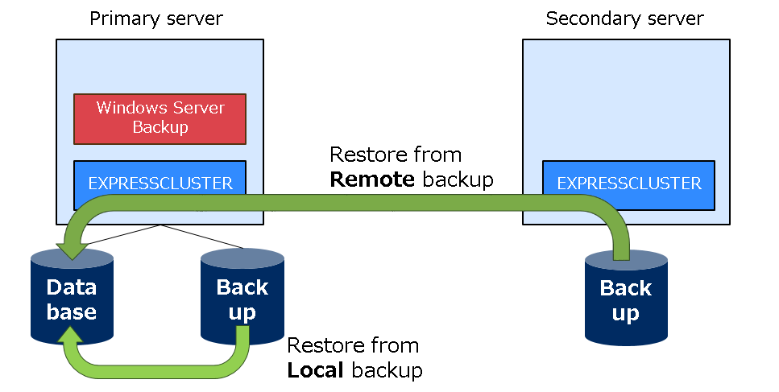

# Windows Server Backup with EXPRESSCLUSTER X

This project is an attempt to create an inexpensive backup solution that's easy to deploy using Microsoft's Windows Server Backup with NEC's CLUSTERPRO/EXPRESSCLUSTER software. The idea is to use Windows Server Backup to create the initial backup copy of important files and folders. This backup is mirrored to a remote location on a different server by EXPRESSCLUSTER X. Windows Server Backup utilizes VSS, enabling backups created on multiple dates to be saved locally and then restored as needed. If the drive where the backups are stored on the primary server goes down, files can be restored from the remote backup location.

## What value does this solution provide?
- Basic backup solution
- Backup scheduling
- Inexpensive disks on the DR site for data backup

## Prerequisites
- Windows Server 2019 Datacenter edition (tested configuration; other editions/versions have not been verified)
- EXPRESSCLUSTER 4.1 with a basic license and a mirroring license
- A dedicated volume on each server to serve as the mirrored backup destination

## Guides
- [Setup guide](Environment%20Configuration.md) — configure the cluster, mirror disk, and Windows Server Backup
- [Add the script resource](Add%20Script%20Resource.md) — required step to preserve snapshot history across failover/failback
- [How to create a backup and restore data](Testing%20Notes.md)
- [Notes and caveats](Things%20To%20Consider.md)

## License
No license file is currently included in this repository. Consider adding one appropriate for your organization's distribution policies.
